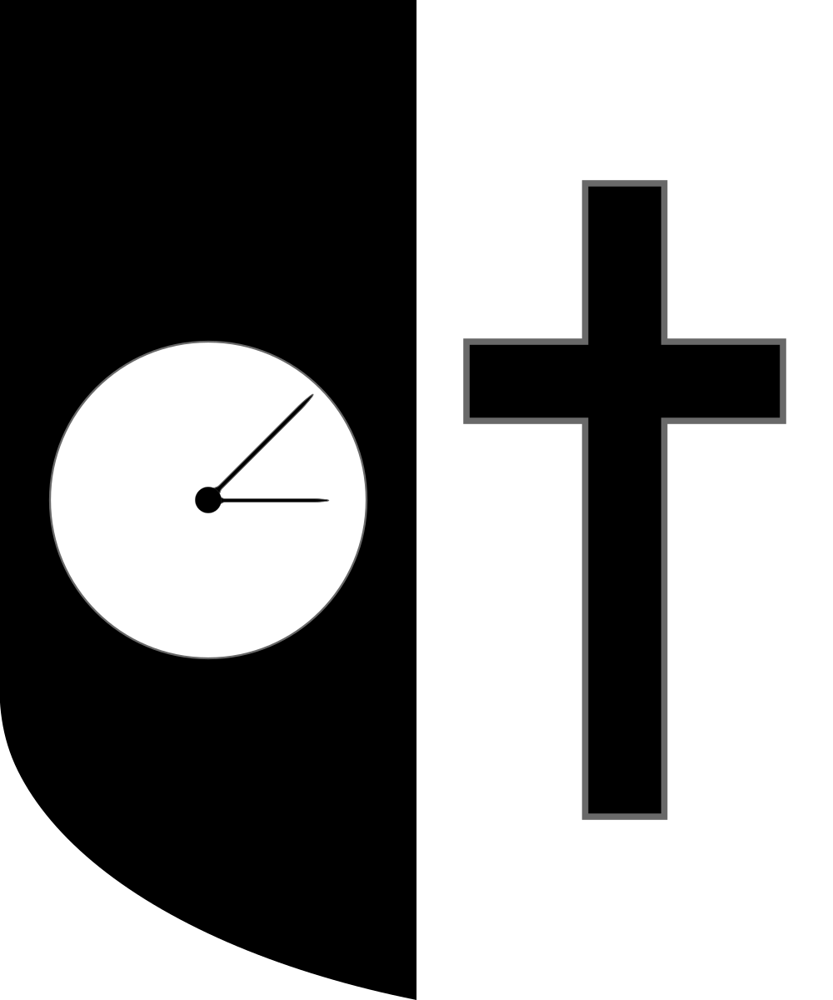

  
   <h2>NDSMD</h2>
   
   
   
   

Hello,
I'm happy to announce you the first pre-release of NDSMD, a catholic android app blocker and time manager designed to help you deliver from the slavery of devil through screen addiction, and help you get closer to God, especially during Lent time.
The name NDSMD was chosen in reference to an inscription on the Saint Benedict medal: NDSMD abbrevation for "Non Draco Sit Mihi Dux" which mean "May the dragon never be my overlord!". I chose this name for this app cause I consider that when we waste time on smartphones, we let the devil dumb us down and guide us.

Bonjour,
Je suis heureux de vous annoncer la première préversion de NDSMD, une application catholique de bloquage d'application et de gestion du temps pour android conçue pour vous aider à vous libérer de l'esclavage du démon à travers les addictions aux écrans, et pour vous aider à vous rapprocher de Dieu, notamment pendant le carême.
Le nom NDSMD a été choisi en réference à une inscription sur la médaille de Saint Benoît : NDSMD abbrévation pour "Non Draco Sit Mihi Dux" ce qui signifie "Que le Diable ne soit pas mon guide !". J'ai choisi ce nom pour cette application car je considère que lorsque que l'on gâche du temps sur le téléphone, on se laisse abrutir et guider par le diable.
